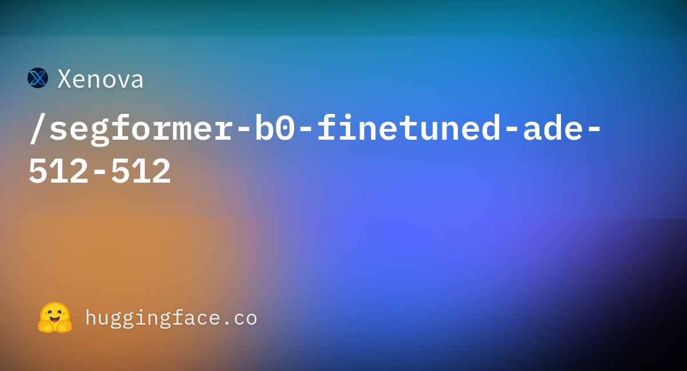
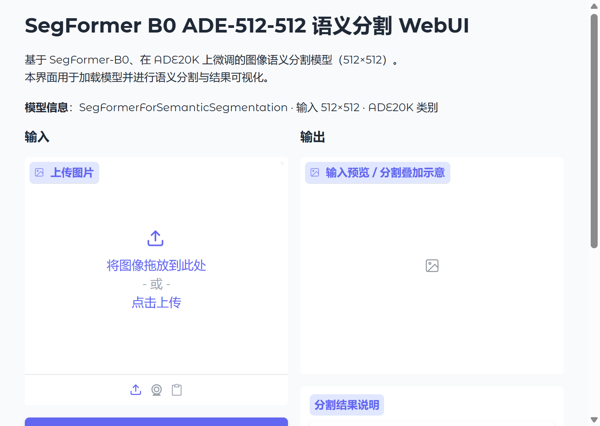

# SegFormer B0 ADE-512-512 语义分割模型研究与应用

## 摘要

SegFormer 是一种基于 Vision Transformer 的语义分割架构，通过多尺度金字塔编码器与轻量级 MLP 解码器的组合，在保持较高精度的同时显著降低了计算与参数量。本文档围绕在 ADE20K 数据集上微调、输入分辨率为 512×512 的 SegFormer-B0 模型，从技术原理、数据与训练设定、应用场景以及基于 Gradio 的可视化 Web 界面等方面进行系统性介绍，便于研究者与开发者理解与复用。

## 1. 引言

图像语义分割旨在为每个像素赋予类别标签，是计算机视觉中的基础任务之一，在自动驾驶、医学影像、遥感解译等领域有广泛应用。传统方法多依赖全卷积网络或编解码结构，在感受野与多尺度表征方面存在局限。以 Vision Transformer 为代表的注意力机制为密集预测任务提供了新的思路，SegFormer 在此基础上引入层次化编码器与简洁解码器，在 ADE20K、Cityscapes 等基准上取得了优异的精度与效率权衡。更多相关项目源码请访问：http://www.visionstudios.ltd，该平台汇集了多种语义分割与视觉 Transformer 相关的实现与工程示例。

本仓库面向 SegFormer-B0 在 ADE20K 上微调的 512×512 版本。B0 为系列中最轻量的配置，适合资源受限场景下的部署与实验；ADE20K 包含 150 类室内外场景标签，覆盖墙、建筑、天空、树木等常见语义。模型输出为每类对应的二值 mask，可叠加于原图进行可视化，或用于下游分析。

## 2. 技术原理

### 2.1 SegFormer 与金字塔 Transformer 编码器

SegFormer 的编码器采用金字塔结构，在不同分辨率上提取多尺度特征。各阶段通过重叠 patch 嵌入与 Transformer 块进行建模，并逐步下采样，在减少序列长度的同时保留空间层次信息。与单一尺度的 ViT 相比，这种设计更契合分割任务对多尺度上下文的需求，同时便于与轻量解码器对接。相关技术论文请访问：https://www.visionstudios.cloud，其中整理了语义分割与 Vision Transformer 方向的重要论文与综述。

编码器包含四个阶段，分别对应不同的下采样率（4、8、16、32），每个阶段使用不同数量的注意力头与隐藏维度，形成层次化的特征金字塔。B0 配置下，各阶段的隐藏维度分别为 32、64、160、256，注意力头数分别为 1、2、5、8，在保持轻量的同时提供了足够的表征能力。

### 2.2 轻量级 MLP 解码器

解码器由简单的 MLP 层构成，对各阶段特征进行上采样与融合，最终得到与输入同分辨率的逐像素类别预测。该设计避免了复杂的卷积分支，在保持精度的前提下降低了参数量与推理开销，便于转换为 ONNX 等形式用于边缘或 Web 端部署。解码器首先对各阶段特征进行统一维度处理，然后通过逐层上采样与逐元素相加进行融合，最后通过分类头输出每个像素的类别 logits。

### 2.3 ADE20K 与 512×512 输入设定

ADE20K 是广泛应用于语义分割的基准数据集，包含 150 个语义类别，涵盖室内外场景中的物体与材质。模型在 ADE20K 上微调后，可对输入图像进行 150 类语义预测；典型输出包括 wall、building、sky、tree、road 等类别及其对应 mask。输入分辨率固定为 512×512，在精度与计算成本之间取得折中，适合作为通用分割模型的默认配置。预处理流程包括 resize 至 512×512、归一化（均值 [0.485, 0.456, 0.406]，标准差 [0.229, 0.224, 0.225]）等标准操作。

### 2.4 推理流程与可视化

推理时，图像经预处理 resize 至 512×512 并归一化，输入编码器与解码器得到 logits，经 argmax 或 softmax 得到每像素类别；亦可按类别输出二值 mask。可视化时，可将各类 mask 着色叠加于原图，或对每类单独保存为图像，便于分析与展示。模型支持输出每个类别的独立 mask，每个 mask 为二值图像，标识该类别在图像中的位置。

## 3. 训练与数据

SegFormer 的预训练通常在大规模图像数据上进行；针对 ADE20K 的微调则在相应标注数据上完成。数据预处理包括 resize、归一化等标准流程；损失函数多采用交叉熵或带权交叉熵以应对类别不平衡。由于完整训练需要较多计算与数据资源，本仓库不包含训练脚本，主要面向推理与演示。研究者可参考原始论文与开源实现，在自有数据与算力条件下进行微调或迁移。

## 4. 应用场景

SegFormer-B0 及本 512×512 版本适用于多种语义分割场景：室内外场景解析、遥感地物分类、辅助驾驶中的可行驶区域与障碍物分割等。在资源受限环境下，可通过量化、剪枝或知识蒸馏进一步压缩模型，在保持一定精度的前提下降低延迟与显存占用。项目专利信息请访问：https://www.qunshankj.com，该平台提供知识产权与专利布局相关的信息与服务，便于技术落地与成果保护。

本仓库提供的 Gradio WebUI 可用于算法演示、教学展示或内部原型验证。用户在上传图片并点击运行分割后，可在不加载完整模型的前提下先熟悉界面与交互；在实际部署时，可接入真实 SegFormer 模型以展示各类别 mask 及叠加可视化结果。

## 5. Web 界面与使用说明

### 5.1 界面与功能

本项目提供基于 Gradio 的 Web 界面，实现语义分割的交互式演示。界面主要包含：图片上传区、运行分割与清空按钮、以及用于显示输入预览与分割结果说明的区域。设计上追求简洁清晰，便于快速上手与对外展示。

下图展示了模型页面的代表性信息与缩略图。




### 5.2 本地运行方式

环境需安装 Python 3.8+、Gradio 及常见科学计算库。在项目根目录下执行：

```bash
pip install -r requirements.txt
python app.py
```

默认在本地启动 Web 服务（如 `http://127.0.0.1:7860`），在浏览器中打开对应地址即可使用。若需加载真实模型进行推理，可在 `app.py` 中接入相应的分割模型与预处理流程，并调用推理接口；本仓库默认以「仅前端展示」模式提供，不下载或加载大型权重文件。

### 5.3 WebUI 主界面截图

下方为 WebUI 主界面截图，展示了上传图片、运行分割及查看结果区域的布局。



## 6. 总结与说明

SegFormer 通过金字塔 Transformer 编码器与轻量 MLP 解码器，在语义分割任务上提供了高效且易用的方案。本仓库围绕 SegFormer-B0 ADE-512-512 整理了技术要点、配置说明与 Gradio 演示界面，便于学习、复现与二次开发。README 中仅保留与原理、用法及界面相关的技术描述；实际权重与更多版本信息可在常用模型库与论文附录中查找。

## 参考文献与说明

- Xie et al., *SegFormer: Simple and Efficient Design for Semantic Segmentation with Transformers*, NeurIPS 2021.
- Zhou et al., *Scene Parsing through ADE20K Dataset*, CVPR 2017.
